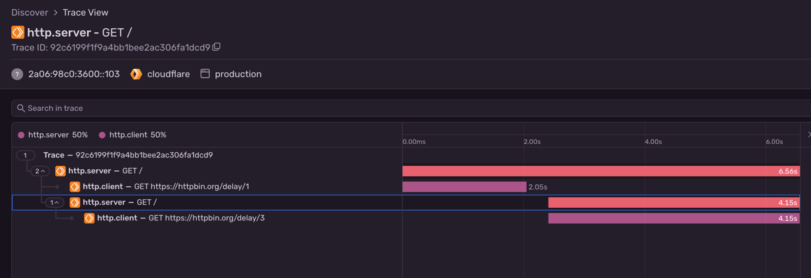
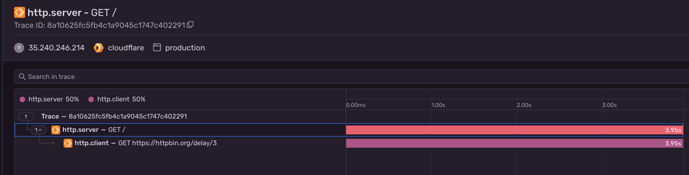

A simple example of sentry with tracing between a cloudflare worker and durable object.

When deployed, the trace looks like this:

But when running locally using `wrangler dev` it will look like:

